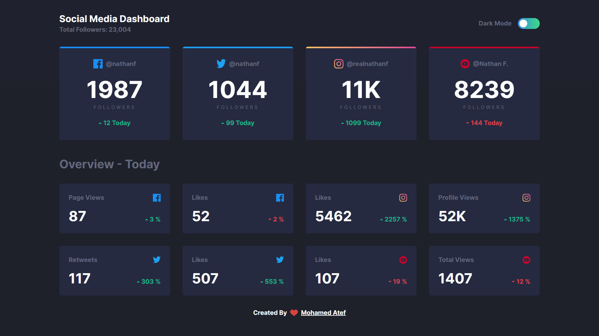

# Frontend Mentor - Social Media theme switcher solution

## Table of contents

- [Overview](#overview)
  - [The challenge](#the-challenge)
  - [Screenshot](#screenshot)
  - [Links](#links)
- [My process](#my-process)
  - [Built with](#built-with)
- [Author](#author)

## Overview

### The challenge

Users should be able to:

- View the optimal layout for the site depending on their device's screen size
- See hover states for all interactive elements on the page
- Toggle color theme to their preference

### Screenshot

### Links

- Solution URL: [Click here](https://github.com/Mohamedate/map)
- Live Site URL: [live site URL](https://map-atef.vercel.app)

### Built with

- React js
- Tailwind CSS

## Author

- My website - [Mohamed Atef](https://atef.vercel.app)
- Frontend Mentor - [@yourusername](https://www.frontendmentor.io/profile/yourusername)
